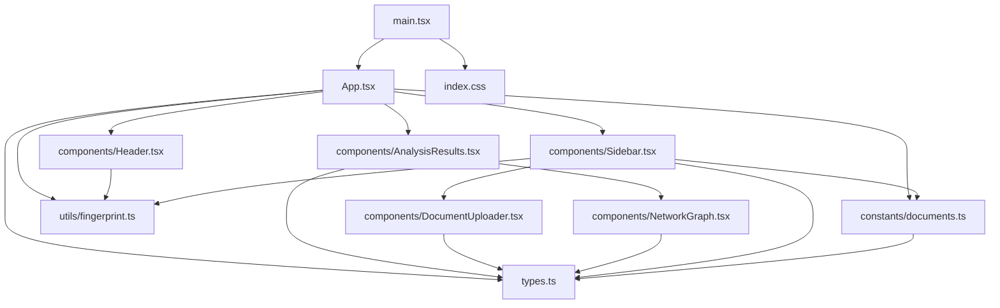

```mermaid
graph TD;
  App_tsx["App.tsx"] --> components_AnalysisResults_tsx["components/AnalysisResults.tsx"];
  App_tsx["App.tsx"] --> components_Header_tsx["components/Header.tsx"];
  App_tsx["App.tsx"] --> components_Sidebar_tsx["components/Sidebar.tsx"];
  App_tsx["App.tsx"] --> constants_documents_ts["constants/documents.ts"];
  App_tsx["App.tsx"] --> types_ts["types.ts"];
  App_tsx["App.tsx"] --> utils_fingerprint_ts["utils/fingerprint.ts"];
  components_AnalysisResults_tsx["components/AnalysisResults.tsx"] --> components_NetworkGraph_tsx["components/NetworkGraph.tsx"];
  components_AnalysisResults_tsx["components/AnalysisResults.tsx"] --> types_ts["types.ts"];
  components_DocumentUploader_tsx["components/DocumentUploader.tsx"] --> types_ts["types.ts"];
  components_Header_tsx["components/Header.tsx"] --> utils_fingerprint_ts["utils/fingerprint.ts"];
  components_NetworkGraph_tsx["components/NetworkGraph.tsx"] --> types_ts["types.ts"];
  components_Sidebar_tsx["components/Sidebar.tsx"] --> components_DocumentUploader_tsx["components/DocumentUploader.tsx"];
  components_Sidebar_tsx["components/Sidebar.tsx"] --> constants_documents_ts["constants/documents.ts"];
  components_Sidebar_tsx["components/Sidebar.tsx"] --> types_ts["types.ts"];
  components_Sidebar_tsx["components/Sidebar.tsx"] --> utils_fingerprint_ts["utils/fingerprint.ts"];
  constants_documents_ts["constants/documents.ts"] --> types_ts["types.ts"];
  main_tsx["main.tsx"] --> App_tsx["App.tsx"];
  main_tsx["main.tsx"] --> index_css["index.css"];
```
