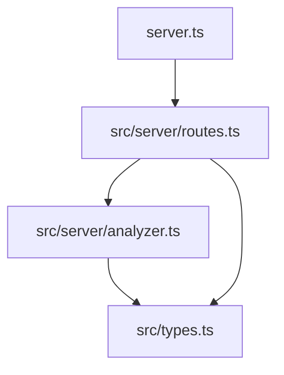

```mermaid
graph TD;
  server_ts["server.ts"] --> src_server_routes_ts["src/server/routes.ts"];
  src_server_analyzer_ts["src/server/analyzer.ts"] --> src_types_ts["src/types.ts"];
  src_server_routes_ts["src/server/routes.ts"] --> src_server_analyzer_ts["src/server/analyzer.ts"];
  src_server_routes_ts["src/server/routes.ts"] --> src_types_ts["src/types.ts"];
```
